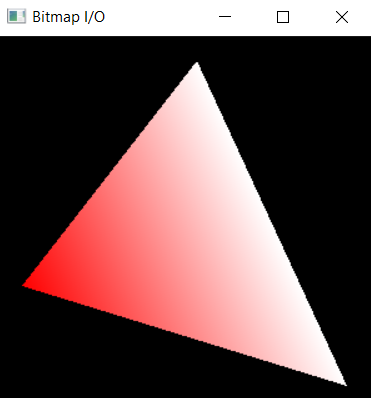
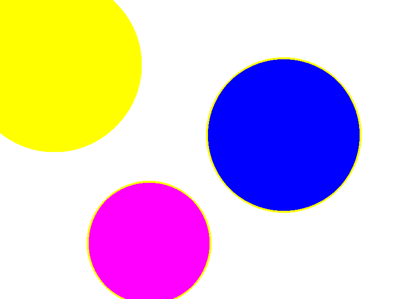
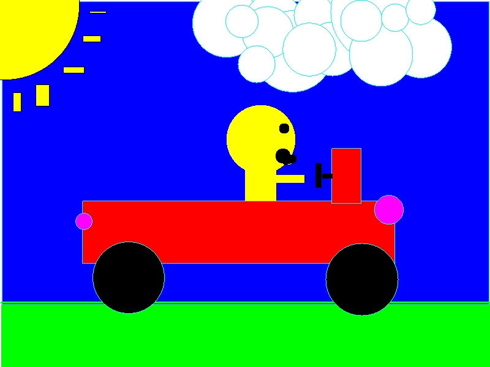

# A2 Report

Author: Terry Tran (sign your name here)

Date: 2021/10/05   (insert the date)

Check [readme.txt](readme.txt) for lab work statement and self-evaluation. 

## Q1 Graphics pipeline (short answer)
	
### Q1.1 Primitives

Graphic primitives is essential the basic element of graphics. The building blocks that graphics are derived from, examples are dots, line segments, triangles, and polygons. Its relation to graphics objects is that to create these objects its requires these primitives to represent the object. What graphics pipeline does to primitives is use them to create a model of the 3D object and then turn them to pixels to then render them in the frame buffer.

### Q1.2 Coordinate systems & transformations

The coordinate systems involved in graphics pipeline are the modeling, world, viewer, normalized device, and screen coordinate systems. Each coordinate system dealing with a specific stage in the graphics pipeline process. The transformations involved in the graphics pipeline are the modeling, viewing, projection, and display transformations. Each transformation is connected with the conversion of two coordinate systems.

### Q1.3 Scan conversion

A scan conversion algorithm will convert primitives into pixels to be sent to the frame buffer. 

{width=90%}

## Q2 OpenGL and Glut (lab practice)
	
### Q2.1 OpenGL primitives
 
Complete? (Yes/No) 

If Yes, insert a screen shot image to show the completion.

{width=90%}

If No,  Add a short description to describe the issues encountered.

### Q2.2 Interactive graphics
 
Complete? (Yes/No) 

If Yes, insert a screen shot image to show the completion.

{width=90%}

If No,  Add a short description to describe the issues encountered.

### Q2.3 Bitmap file I/O
 
Complete? (Yes/No) 

If Yes, insert a screen shot image to show the completion.

{width=90%}

If No,  Add a short description to describe the issues encountered.

## Q3 SimpleDraw (programming)
	
### Q3.1 Display window and menu
 

Complete? (Yes/No) 

If Yes, insert a screen shot image to show the completion.

[Completed window and menu](images/window and menu.png){width=90%}

If No, add a short description to describe the issues encountered.

### Q3.2 Data structures
 

Complete? (Yes/No) 

If Yes, insert a screen shot image to show the completion.

[Completed data structure](images/data structure.png){width=90%}

If No, add a short description to describe the issues encountered.

### Q3.3 Draw rectangles
 

Complete? (Yes/No) 

If Yes, insert a screen shot image to show the completion.

[Created rectangles](images/rectangles.png){width=90%}

If No, add a short description to describe the issues encountered.

### Q3.4 Draw circles
 

Complete? (Yes/No) 

If Yes, insert a screen shot image to show the completion.

[Created circles](images/circles.png){width=90%}

If No, add a short description to describe the issues encountered.

### Q3.5 Edit features
 

Complete? (Yes/No) 

If Yes, insert a screen shot image to show the completion.

[Various edit features](images/edit features.png){width=90%}

If No, add a short description to describe the issues encountered.

### Q3.6 Save/Open SVG files

Complete? (Yes/No).   If Yes, [output.svg](images/output.svg).

### Q3.7 Export to bitmap

Complete? (Yes/No).   If Yes, .

### Q3.8 Circle&Square artwork

Complete? (Yes/No).   If Yes, [C&S artwork in SVG](images/c&s.svg), .

**References**

1. CP411 a2
2. Add your references if you used. 
